# INTRODUCTION

**UPDATE**: *CVE-2021-26777 has been assigned to the buffer overflow vulnerability described in the following article.*

This article reveals the results of the analysis of one of the several electrical smart metering concentrators available in the Spanish market, and widely spread throughout Spain and Portugal.

All the vulnerabilities have been communicated to the vendor (with no response from his side), and it looks like they don't care too much, because after more than a year (and several firmware versions later) the last firmware version shows the same weaknesses. Trying to follow a constructive approach, all the references to the vendor have been shaded.

This article doesn't intend to be the result of a deep review of the firmware. Rather, it tries to show how with a quick and dirty analysis of one of the multiple devices controlling critical infrastructures, several vulnerabilities arise.

# PHYSICAL ACCESS

TLDR: Once you have physical access to the device, the game is over.

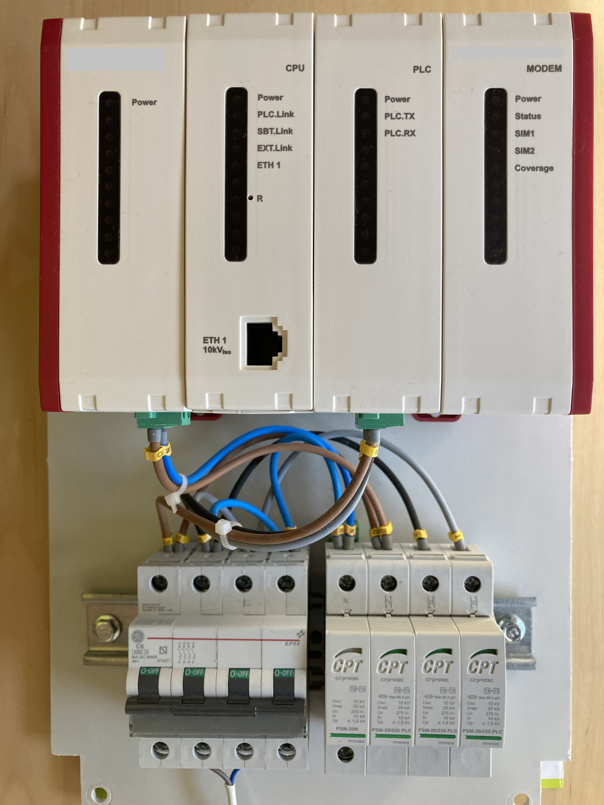

A quick glance at the device shows that the lid labelled as *CPU* can be easily removed just levering it open. Inside you can find a PCB with a three PIN header that invites us to connect a serial adapter.

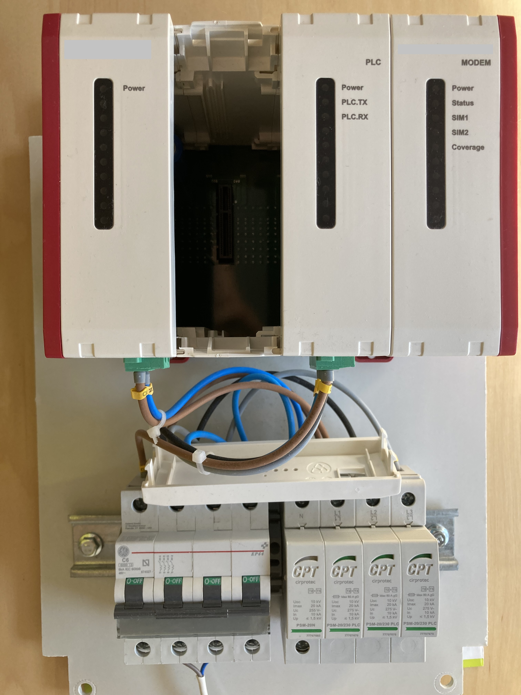

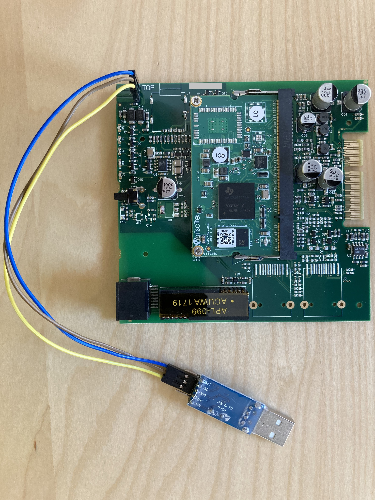

At this point, we just need to follow the official documentation where the default credentials are colleted to gain console access.

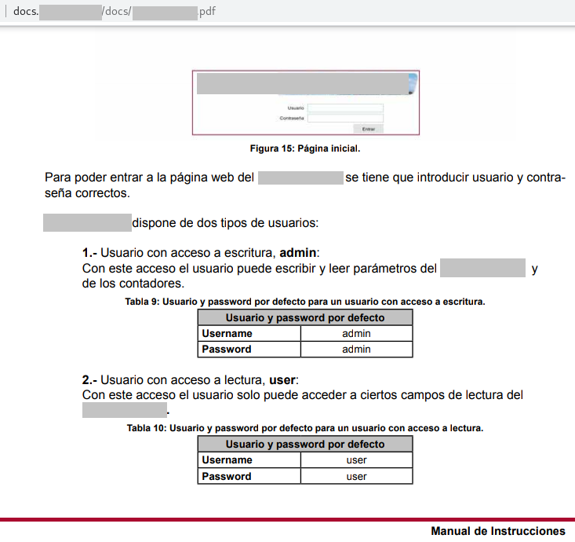

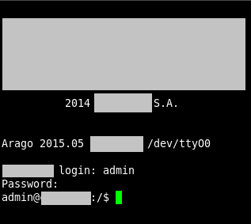

To be fair, using those users to access the device via Web (through clear HTTP by default :-( ), the Web portal suggests changing the default password.

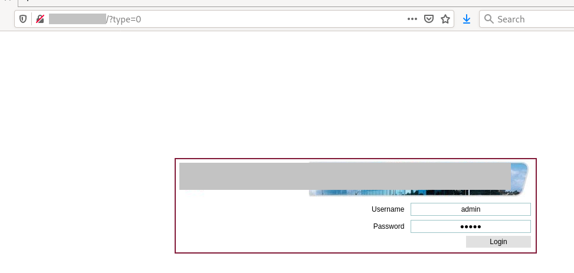

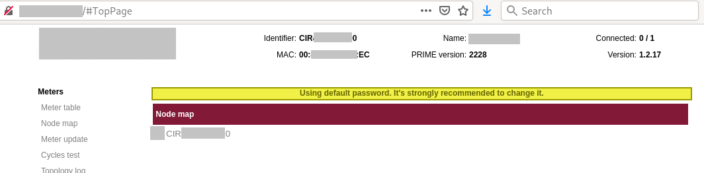

By the way, and talking about the Web portal, it was detected that an anonymous user could get the node map just by requesting the correct URL. No authentication needed. A bug or a feature?

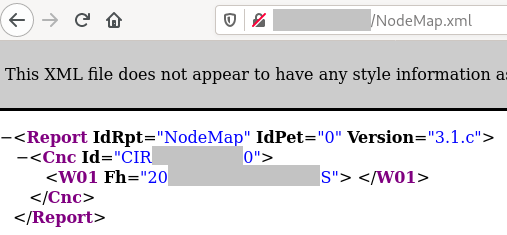

# PRIVILEGE ESCALATION

OK. We have **admin** access to interact with the concentrator via serial console. But, looking at most of the processes we can appreciate that they are running as **root** so, wouldn't it be great to be root too?

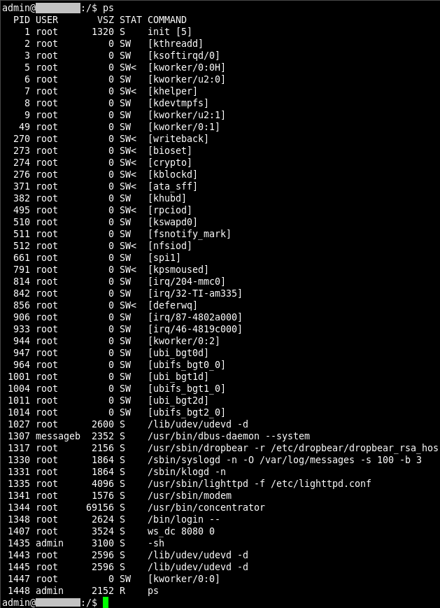

## PRIVILEGE ESCALATION: THE COOL WAY

Navigating within the web portal, a firmware update functionality was detected.

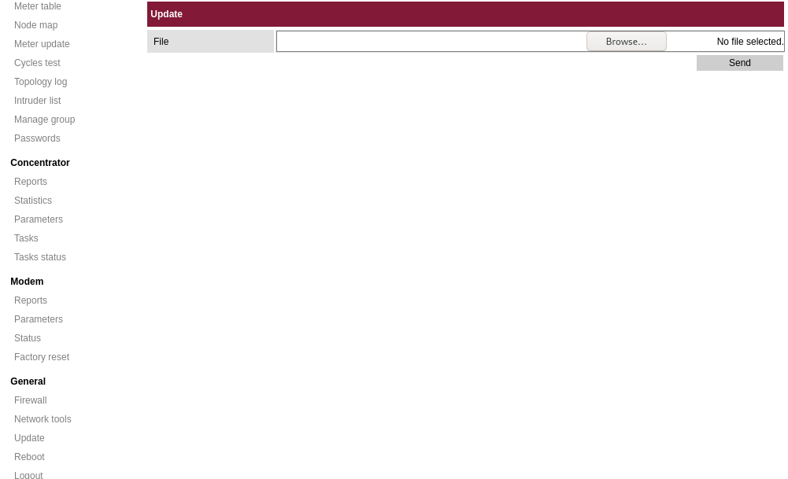

However, looking at the firmware file distributed by the vendor, and used for the previous update function, we just see an OpenSSL encrypted file (*data*) and a MD5 sum file (*hash.md5*), both packed into a *tar* file

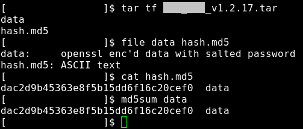

Analysing the changes in the filesystem, taking advantage of the **admin** serial access, while the firmware update was running, it was noticed that the updating system used the "*/tmp/updateDC/*" directory to temporarily unpack all the files to be updated, to move them to the necessary directory afterwards.

As the "*/tmp/updateDC/*" directory was readable by all system users, it was possible to make a copy of all the involved files to an **admin** controlled directory, before they were moved to the directories just accessible by the **root** user.

Taking a look at the **concentrator** binary it was identified as one of the main processes of the concentrator, with several important functions. One of these functions was "*UpgradeSystem*", in charge of the firmware update process. An interesting reference was found inside this binary, that gave us some information to encrypt and decrypt the original "*data*" firmware file.

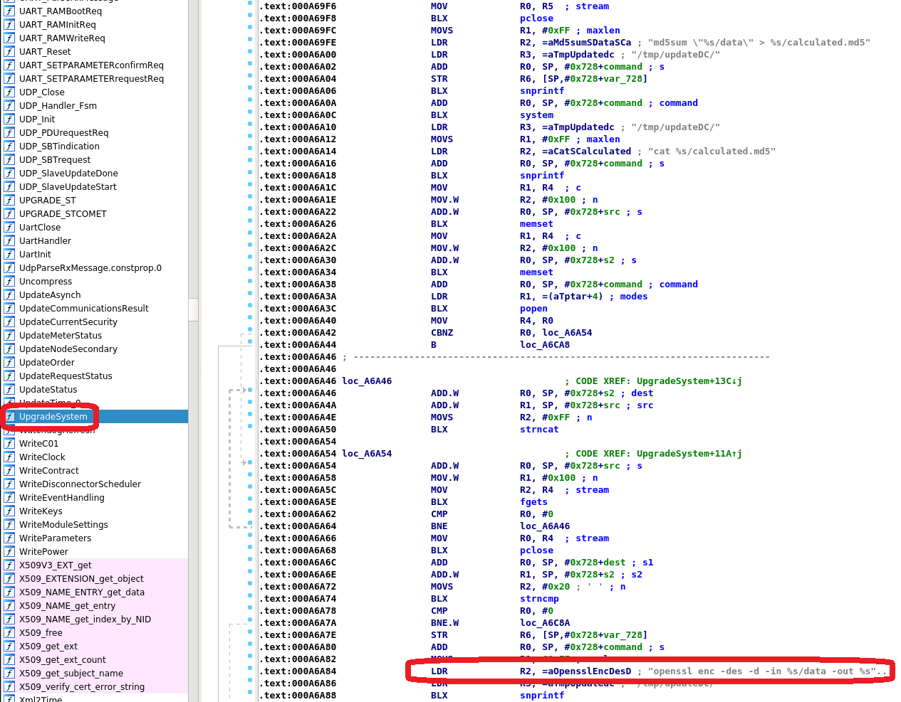

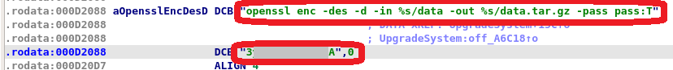

OK, OK... now that I look cool enough due to the previous IDA Pro screenshot, let's show a simpler way to get the same result.

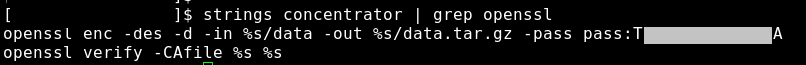

Reviewing the files packed in the "**data**" file, an "**update.sh**" shell script was found where all the commands to deploy the new files were listed, and all those commands are going to be executed as **root** user. In that way, hopefully we could make a new "update.sh" script, packing and encrypting it together with all the desired files, as a new firmware to be deployed in the device.

Let's say that with the following commands we could gain **root** access via SSH:

	$ cat update.sh
	#!/bin/sh
	echo "ssh-rsa AAAAC1Mh… root@foobar" >> /root/.ssh/authorized_keys
	exit 0
	$ chmod +x update.sh
	$ tar czf data.tar.gz update.sh
	$ openssl enc -des -in data.tar.gz -out data -pass pass:TblahblahblahA
	$ md5sum data > hash.md5
	$ tar cf my_little_firmware.tar data hash.md5

## PRIVILEGE ESCALATION: THE EASY WAY

Another functionality found in the web portal allowed us to download reports.

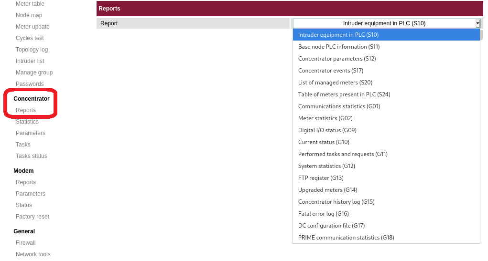

With some static analysis of the **index.cgi** binary executed by the web server, it was reached a function that reveals that the final report was composed concatenating several files from "*/tmp/*" directory (“*/tmp/cnc.log.1*”, “*/tmp/cnc.log.1*” and “*/tmp/cnc.log*”)

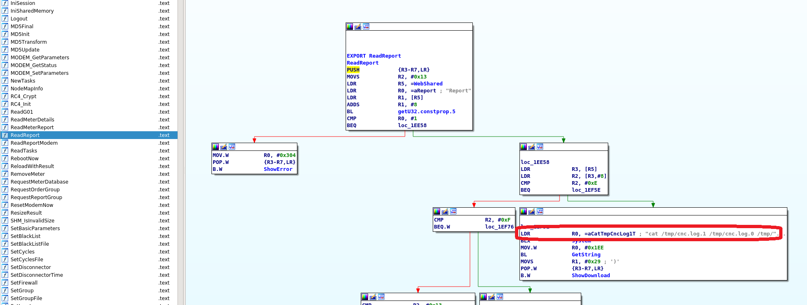

So, why not create a symbolic link to "*/etc/shadow*" and request that report?

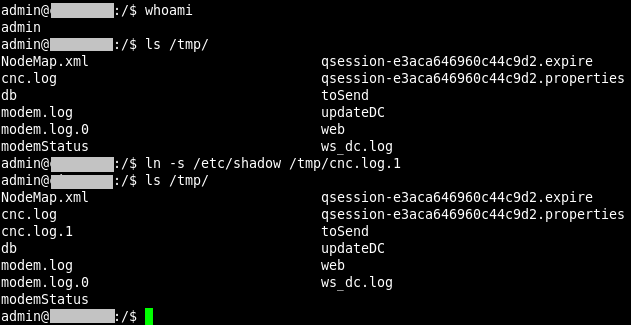

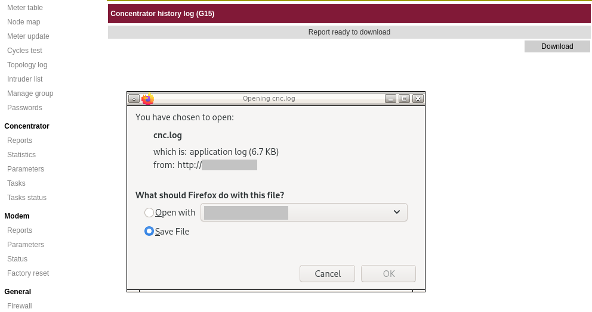

As the avid reader can already imagine, we will get a dump of the shadow file (remember from one of the previous images that nearly all the processes were running as **root**):

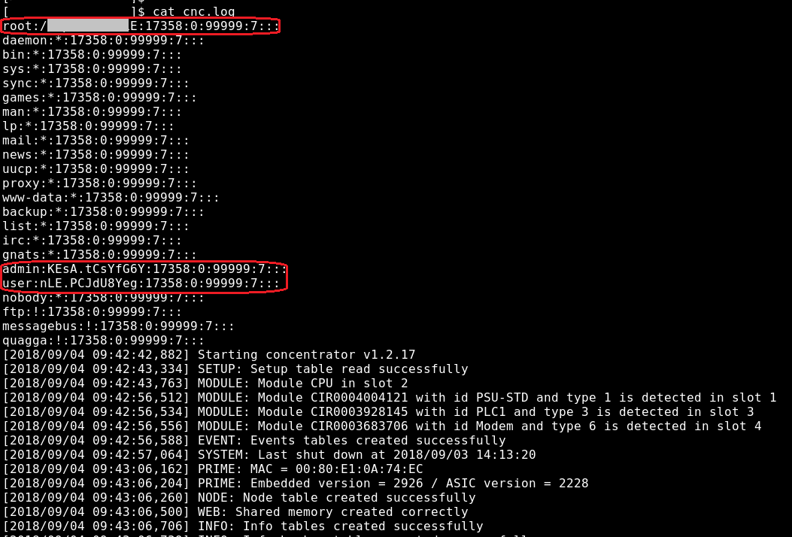

A short *hashcat* process would finally reveal a not so complex **root** password.

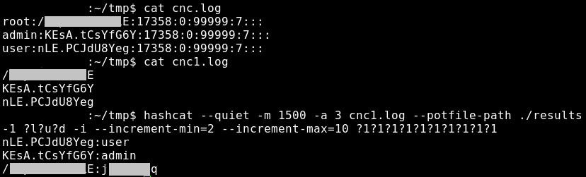

# BUFFER OVERFLOW

Once we have serial and SSH access as **admin** and as **root**, we can start playing with the running binaries.

Taking **index.cgi** as one critical binary, due to its exposure through the Web portal, it is worth taking a glance at it.

After a while looking at the application inputs and how they were processed, it was found that the IP address value entered in the "*Firewall*" function didn't have any kind of filter or control.

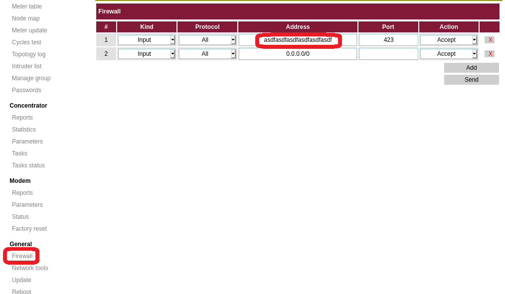

On top of that, that value is copied to a stack variable using the "*strcpy*" function.

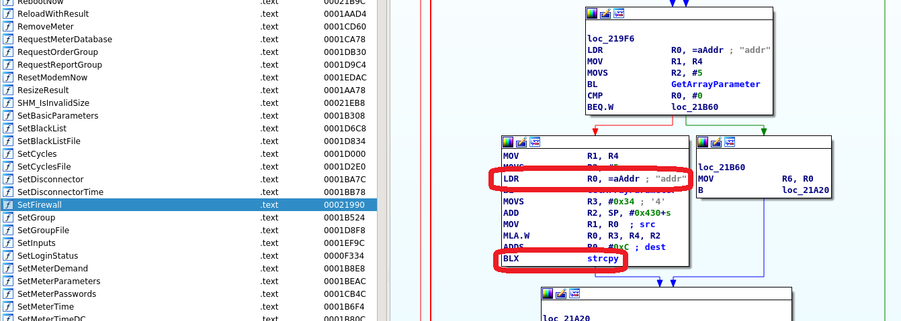

So let's try sending a really long "IP address" and look how the process reacts.

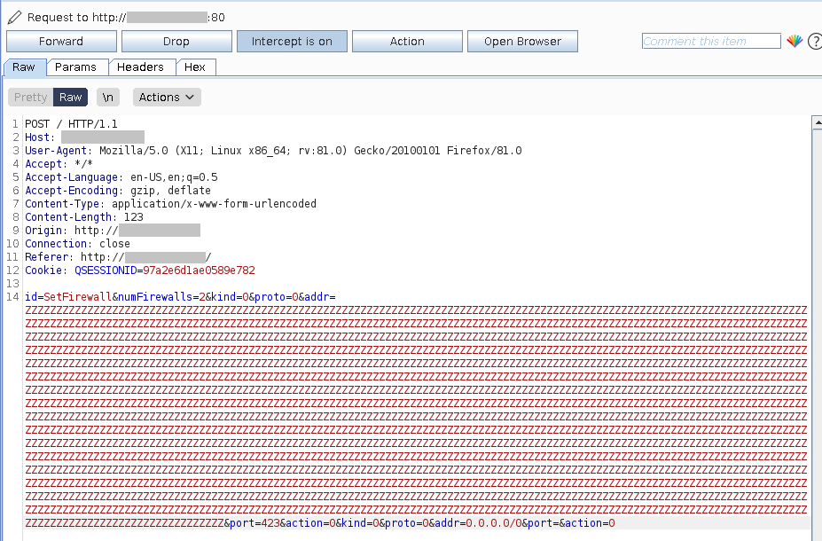

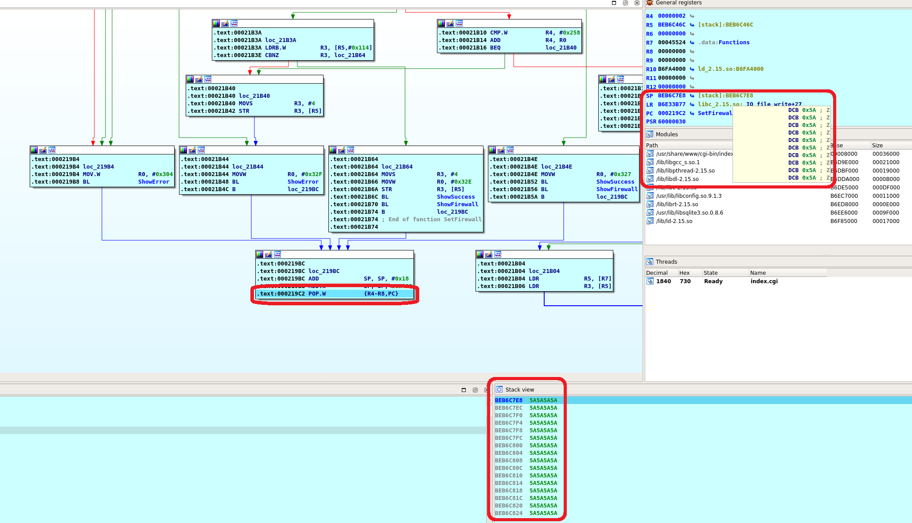

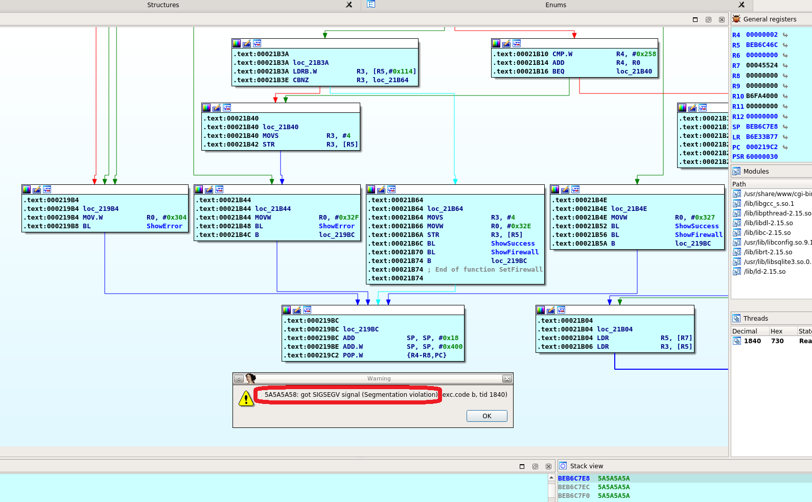

As we can see, the program counter is reached and a potential remote code execution is in place.

# CONCLUSION

As was initially said, this article has been just an Q&D review. Probably, a lot of bugs are missed in the analysed and similar concentrators.

The intention is not to damage a specific vendor's reputation, but to transmit the need of applying the correct software development cycles, and security reviews, to the software products in use in industrial environments.
